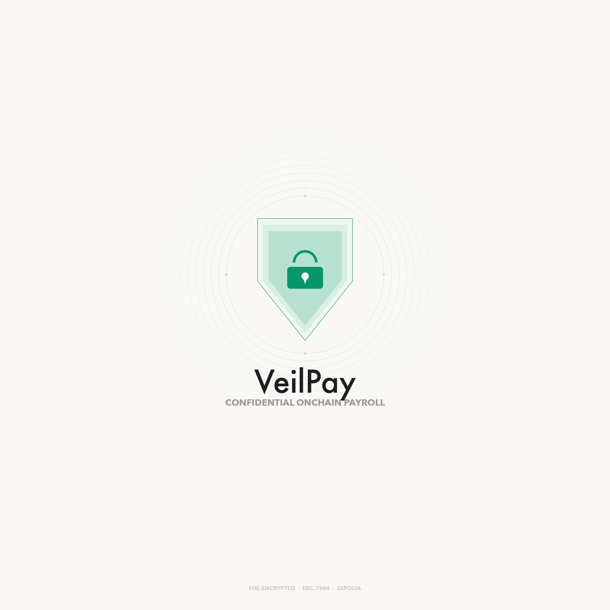

<p align="center">
  
</p>

# VeilPay

**Confidential onchain payroll powered by Fully Homomorphic Encryption.**

VeilPay lets companies pay employees on-chain while keeping individual salaries and transaction amounts completely private. Built on fhEVM, salary data is encrypted end-to-end — only the employer and the respective employee can decrypt their own figures. On-chain observers see only ciphertext.

## Features

- **Encrypted salaries** — Salary amounts are FHE-encrypted client-side before touching the blockchain.
- **Selective disclosure** — ACL-based access control grants decryption rights only to the employer and the individual employee.
- **Confidential transfers** — Payroll execution uses ERC-7984 confidential token transfers. Amounts stay encrypted on-chain.
- **Batch payroll** — Pay all employees in a single transaction.
- **Employee self-service** — Employees can decrypt and verify their own salary and payment history via EIP-712 signed re-encryption requests.

## Architecture

```
┌──────────────────────────────────────────────┐
│            Frontend (React + Vite)            │
│   ConnectKit · wagmi · @zama-fhe/relayer-sdk  │
└──────────────┬───────────────────┬───────────┘
               │                   │
   ┌───────────▼──────┐  ┌────────▼──────────┐
   │ ConfidentialPayroll│  │  PayrollToken     │
   │ (Payroll Manager) │  │  (ERC-7984 Token) │
   └───────────┬──────┘  └────────┬──────────┘
               │    FHE Operations │
   ┌───────────▼──────────────────▼──────────┐
   │  fhEVM Coprocessor + KMS (Sepolia)      │
   └─────────────────────────────────────────┘
```

## Smart Contracts

| Contract | Description | Address (Sepolia) |
|----------|-------------|-------------------|
| `PayrollToken` | Confidential ERC-7984 fungible token (pUSD) with encrypted balances and operator model | `0xa6daf4C41b62Be614c9596828C371492E7109FFc` |
| `ConfidentialPayroll` | Payroll manager — encrypted salary storage, employee management, batch payroll execution | `0x914B2b9bbe76C4BA1Ec35785791Ada874Af5801b` |

### Key Functions

**Employer:**
- `addEmployee(address, externalEuint64, bytes)` — Add employee with FHE-encrypted salary
- `updateSalary(address, externalEuint64, bytes)` — Update an employee's encrypted salary
- `removeEmployee(address)` — Deactivate an employee
- `executePayroll()` — Transfer encrypted salaries to all active employees
- `executePayrollBatch(uint256, uint256)` — Batch payroll for gas management

**Employee:**
- `getMySalary()` — Returns encrypted salary handle (decrypt via KMS re-encryption)
- `getEmployeeInfo(address)` — Returns public metadata (status, last pay date, enrollment date)

**Token:**
- `mint(address, uint64)` — Mint pUSD tokens (owner only)
- `confidentialTransfer(address, euint64)` — Transfer with encrypted amount
- `confidentialTransferFrom(address, address, euint64)` — Operator transfer
- `setOperator(address, uint48)` — Time-limited operator approval (ERC-7984 pattern)

## Tech Stack

| Layer | Technology |
|-------|-----------|
| Smart Contracts | Solidity 0.8.24 · `@fhevm/solidity` v0.11.1 · Hardhat |
| FHE Infrastructure | fhEVM Coprocessor · KMS (threshold MPC) · Sepolia testnet |
| Frontend | React 19 · Vite · TypeScript · Tailwind CSS · shadcn/ui |
| Web3 | wagmi v3 · viem · ConnectKit · `@zama-fhe/relayer-sdk` v0.4.1 (CDN) |
| Animation | motion (framer-motion) |
| Testing | `@fhevm/hardhat-plugin` · `@fhevm/mock-utils` · Chai · Mocha |

## Getting Started

### Prerequisites

- Node.js >= 22
- A wallet with Sepolia ETH ([faucet](https://sepoliafaucet.com))

### Smart Contracts

```bash
cd contracts
npm install
cp .env.example .env
# Edit .env with your PRIVATE_KEY and SEPOLIA_RPC_URL

# Compile
npx hardhat compile

# Run tests (16 tests, mock FHE mode)
npx hardhat test

# Deploy to Sepolia
npx hardhat run scripts/deploy.ts --network sepolia

# Mint tokens to employer
npx hardhat run scripts/mint.ts --network sepolia
```

### Frontend

```bash
cd frontend
npm install
cp .env.example .env
# Edit .env with contract addresses from deploy output

# Development
npm run dev

# Production build
npm run build
```

## Testing the Full Flow

### As Employer (deployer wallet)

1. Connect wallet on the Employer page
2. **Add Employee** — Enter employee wallet address + salary amount. The salary is FHE-encrypted client-side before submission.
3. **Approve Operator** — Authorize the Payroll contract to transfer tokens on your behalf.
4. **Execute Payroll** — Encrypted salary amounts are transferred to all active employees via confidential ERC-7984 transfers.

### As Employee (employee wallet)

1. Connect with the employee wallet on the Employee page
2. View encrypted salary and balance
3. **Decrypt & View** — Sign an EIP-712 message to request KMS re-encryption. Only you can decrypt your own salary.
4. **Payment History** — View confidential transfer events with Etherscan links.

## How FHE Privacy Works

```
Employer sets salary    →  Client encrypts with FHE public key
                        →  ZK proof generated + ciphertext uploaded to coprocessor
                        →  Contract stores encrypted handle + sets ACL permissions

Employee views salary   →  Contract returns encrypted handle (uint256)
                        →  Employee signs EIP-712 authorization
                        →  KMS verifies ACL, re-encrypts under employee's ephemeral key
                        →  Employee decrypts locally → plaintext salary displayed
```

**Privacy guarantees:**
- Salary values are never exposed on-chain in plaintext
- Only the employer and the respective employee have ACL permission to decrypt
- The KMS uses threshold MPC (2/3 of 13 nodes) — no single party can decrypt
- All operations are auditable on-chain without revealing amounts

## Project Structure

```
veilpay/
├── contracts/
│   ├── contracts/
│   │   ├── ConfidentialPayroll.sol    # Payroll manager
│   │   └── PayrollToken.sol          # ERC-7984 confidential token
│   ├── test/
│   │   └── ConfidentialPayroll.test.ts # 16 tests
│   ├── scripts/
│   │   ├── deploy.ts                 # Deploy both contracts
│   │   └── mint.ts                   # Mint pUSD tokens
│   └── hardhat.config.ts
├── frontend/
│   ├── src/
│   │   ├── components/
│   │   │   ├── employer/             # Dashboard, AddEmployee, EmployeeTable, ExecutePayroll
│   │   │   ├── employee/             # Dashboard, SalaryCard, PaymentHistory
│   │   │   ├── layout/               # Header, Layout
│   │   │   ├── ui/                   # shadcn components
│   │   │   └── CryptoOrbit.tsx       # Animated encryption visualization
│   │   ├── lib/
│   │   │   ├── contracts.ts          # ABIs + addresses
│   │   │   └── fhe.ts               # FHE SDK integration (encrypt/decrypt)
│   │   ├── hooks/                    # useFHE, usePayrollContract, useTokenContract
│   │   └── pages/                    # Home, Employer, Employee
│   └── index.html
└── veilpay-logo.png
```

## License

MIT
